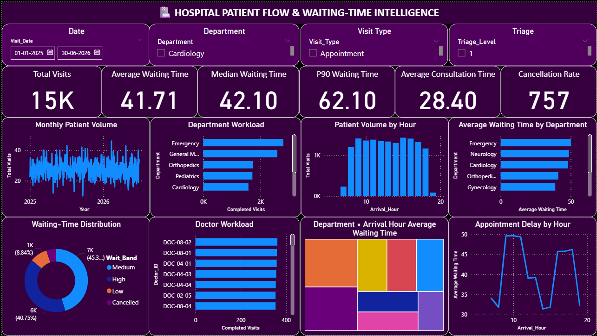

# 🏥 Hospital Patient Flow & Waiting-Time Intelligence

## 📊 Project Overview

Hospital Patient Flow & Waiting-Time Intelligence is a healthcare analytics project designed to analyze patient arrivals, department workload, waiting times, appointment delays, doctor workload, and patient flow.

The project identifies operational bottlenecks and provides data-driven recommendations for improving hospital resource allocation and patient flow.

> **Note:** This is an operational analytics and decision-support project. It is not a clinical diagnosis or medical decision-making system.

---

## 🎯 Objectives

- Analyze patient visit volume and flow
- Identify departments with high workloads
- Analyze patient waiting times
- Identify peak patient arrival hours
- Measure appointment delays
- Analyze doctor workload
- Identify department and time-based bottlenecks
- Analyze cancellation patterns
- Support staffing and capacity planning

---

## 📁 Dataset

The project uses an anonymized dataset containing **15,000 patient visits**.

### Main Fields

- Visit_ID
- Patient_ID_Anonymized
- Department
- Visit_Date
- Arrival_Time
- Appointment_Time
- Doctor_ID
- Triage_Level
- Waiting_Time
- Consultation_Time
- Total_Time
- Visit_Type
- Admission_Flag
- Discharge_Time
- Cancellation_Flag

No personally identifiable information is included.

---

## 🛠️ Technologies Used

- **Python** — Data analysis and preprocessing
- **Pandas** — Data manipulation
- **NumPy** — Numerical analysis
- **Power BI** — Interactive dashboard and visualization
- **DAX** — KPI calculations
- **SQL** — Analytical queries
- **Excel/CSV** — Dataset

---

## 📊 Dashboard



### Dashboard Features

The Power BI dashboard includes:

- Total Visits
- Average Waiting Time
- Median Waiting Time
- 90th Percentile Waiting Time
- Average Consultation Time
- Cancellation Rate
- Monthly Patient Volume
- Department Workload
- Patient Volume by Hour
- Average Waiting Time by Department
- Waiting-Time Distribution
- Doctor Workload
- Department × Arrival Hour Bottleneck Heatmap
- Appointment Delay by Hour

---

## 📈 Key KPIs

| KPI | Value |
|---|---:|
| Total Visits | 15,000 |
| Average Waiting Time | 39.6 min |
| Median Waiting Time | 40.9 min |
| P90 Waiting Time | 61.7 min |
| Average Consultation Time | 27.0 min |
| Cancellation Rate | 5.0% |

---

## 🚨 Bottleneck Analysis

The dashboard helps identify:

- Departments experiencing excessive waiting times
- High-volume patient periods
- Peak arrival hours
- Doctor workload imbalance
- Appointment scheduling delays
- Department capacity gaps

---

## 💡 Operational Recommendations

Based on the analytics, hospitals can consider:

- Adjusting staffing levels during peak hours
- Redistributing appointment slots
- Increasing capacity in consistently overloaded departments
- Allocating additional resources during high-demand periods
- Monitoring departments with high P90 waiting times
- Optimizing doctor workload distribution

---

## 📂 Project Structure

```text
Hospital-Patient-Flow-Waiting-Time-Intelligence/
│
├── dashboard.png
├── hospital_visits.csv
├── Hospital_Patient_Flow.pbix
├── README.md
│
├── python/
│   └── patient_flow_analysis.py
│
└── sql/
    └── hospital_analytics.sql